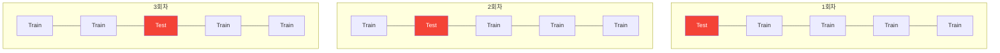
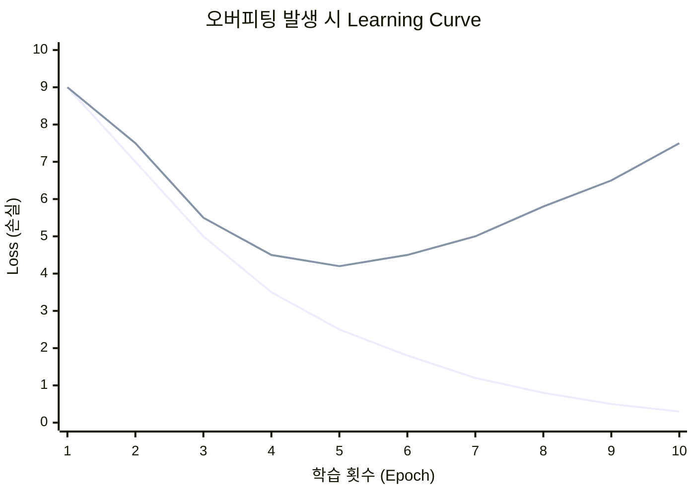

# 데이터 기초 개론

> ⏱ 15분 | 참조 자료

AI/머신러닝에서 **"데이터"**는 모델이 학습하고 평가받는 재료입니다.
아무리 좋은 알고리즘이라도 데이터를 제대로 다루지 못하면 의미 있는 결과를 낼 수 없습니다.
이 장에서는 데이터를 다루는 가장 기초적인 개념 세 가지를 다룹니다.

---

## 1. 학습 데이터와 테스트 데이터의 분리

### 왜 분리하는가?

모델은 주어진 데이터의 패턴을 학습합니다.
그런데 학습에 사용한 데이터로 성능을 평가하면, 모델이 정답을 **"외웠는지"** 아니면 진짜 **"이해했는지"** 구분할 수 없습니다.

> 시험 문제를 미리 알고 본 시험에서 100점을 받는 것과 같습니다.

따라서 데이터를 반드시 학습용(Training Set)과 평가용(Test Set)으로 나눠야 합니다.

### 대표적인 데이터 분리 기법

분리 방식에 따라 모델 정확도의 신뢰성이 달라집니다. 잘못 분리하면 학습 시 93%인데 실제 배포 후 78%가 될 수 있습니다.

#### Hold-Out (단순 분리)


#### K-Fold 교차 검증 (K=5 예시)



> 매 회차마다 다른 Fold가 테스트 → 5번 반복 → 평균 성능 = 안정적 평가

| 기법 | 핵심 개념 | 적합한 상황 | 정확도 신뢰도 |
|------|-----------|------------|:------------:|
| **Hold-Out** | 데이터를 한 번만 학습/테스트로 분리 | 데이터가 충분히 많을 때 (10만+) | 보통 |
| **K-Fold CV** | K등분 → K번 반복 학습/평가 → 평균 | 데이터가 적을 때, 안정적 평가 필요 시 | 높음 |
| **Stratified K-Fold** | K-Fold + 각 Fold에서 클래스 비율 유지 | 클래스 불균형 분류 문제 (가장 권장) | 매우 높음 |
| **Time Series Split** | 시간 순서대로 과거→학습, 미래→테스트 | 주가, 날씨, 로그 등 시계열 데이터 | 높음 |

### 데이터가 부족할 때 — 데이터 증강(Data Augmentation)

데이터가 적거나 클래스가 불균형할 때, 기존 데이터를 기반으로 합성 데이터를 생성하여 학습량을 늘립니다.
증강은 **학습 데이터에만** 적용하며, 테스트 데이터는 절대 증강하지 않습니다.

#### SMOTE 원리


#### 이미지 증강 예시


> 원본 1장 → 증강으로 4~10장의 변형 데이터 생성 가능

| 기법 | 대상 | 핵심 원리 |
|------|------|-----------|
| **SMOTE** | 테이블 데이터 | 소수 클래스 샘플 사이를 보간하여 합성 데이터 생성 |
| **이미지 증강** | 이미지 데이터 | 회전, 반전, 크기 조절, 색상 변환 등으로 변형 데이터 생성 |
| **XGBoost + SMOTE** | 불균형 분류 | 적은 데이터에 강한 앙상블 모델 + 증강 조합 → 재현율 60%→85% 개선 |

---

## 2. 오버피팅(과적합) 문제

### 오버피팅이란?

모델이 학습 데이터에 **지나치게 맞춰져서**, 학습 데이터에서는 정확도가 높지만 새로운 데이터에서는 성능이 급격히 떨어지는 현상입니다.
모델이 데이터의 일반적인 패턴이 아니라 **노이즈(잡음)까지 외워버린 상태**입니다.

#### Learning Curve (학습 곡선) — 오버피팅 판별의 핵심

학습이 진행될수록 Training Loss와 Validation Loss가 어떻게 변하는지 관찰하면 오버피팅을 판별할 수 있습니다.



> Training Loss는 계속 줄어드는데 Validation Loss가 다시 올라가는 지점 = **오버피팅 시작**
> 위 그래프에서 Epoch 5 부근이 최적의 학습 중단 지점(Early Stopping)

### 오버피팅 vs 언더피팅

| 상태 | 학습 정확도 | 테스트 정확도 | 설명 |
|------|:-----------:|:------------:|------|
| **언더피팅** | 낮음 | 낮음 | 모델이 너무 단순, 패턴 포착 실패 |
| **적절한 학습** | 높음 | 높음 | 일반적 패턴 포착, 새 데이터에도 잘 작동 |
| **오버피팅** | 매우 높음 | 낮음 | 노이즈까지 외워버린 상태 |


---

## 3. 데이터 타입별 변환 방법

### 3-1. 텍스트 데이터 → CSV / Pandas DataFrame

텍스트 데이터는 **CSV** 파일로 저장하고, **Pandas**로 DataFrame으로 변환하여 다룹니다.

#### CSV 파일 예시

```csv
text,label
"오늘 날씨가 좋습니다",긍정
"서비스가 너무 불편합니다",부정
"보통이에요",중립
```

#### Pandas로 읽기

```python
import pandas as pd

df = pd.read_csv("data.csv")

print(df.head())       # 상위 5개 행 확인
print(df.shape)        # (행 수, 열 수)
print(df.info())       # 데이터 타입과 결측치
print(df.describe())   # 기본 통계 정보
```

#### DataFrame 핵심 기능

```python
df["text"]                             # 특정 열 선택
df.dropna()                            # 결측치 행 제거
df["label"].value_counts()             # 클래스별 데이터 수
df.sample(frac=1)                      # 데이터 셔플
df.to_csv("output.csv", index=False)   # CSV로 저장
```

---

### 3-2. 이미지 데이터 → RGB 값 변환

컴퓨터는 이미지를 **픽셀 단위의 숫자 배열**로 인식합니다.
각 픽셀은 **RGB**(Red, Green, Blue) 세 채널의 값(`0~255`)으로 구성됩니다.

#### 이미지 구조

| 타입 | 배열 형태 | 설명 |
|------|-----------|------|
| **흑백** (Grayscale) | `(높이, 너비)` | 각 픽셀: `0`(검정) ~ `255`(흰색) |
| **컬러** (RGB) | `(높이, 너비, 3)` | 각 픽셀: `[R, G, B]` 예) `[255, 0, 0]` = 빨간색 |

#### 이미지 → 숫자 배열 변환

```python
from PIL import Image
import numpy as np

img = Image.open("photo.jpg")
img_array = np.array(img)

print(img_array.shape)    # 예: (224, 224, 3)
print(img_array.dtype)    # uint8 (0~255)
print(img_array[0][0])    # 첫 픽셀의 [R, G, B]
```

#### 정규화 (Normalization)

픽셀 값을 `0~1` 범위로 변환하면 학습 속도와 안정성이 향상됩니다.

```python
img_normalized = img_array / 255.0    # 0~255 → 0.0~1.0
```

#### 이미지 크기 통일 (Resize)

모델 입력을 위해 모든 이미지 크기를 동일하게 맞춥니다.

```python
img_resized = img.resize((224, 224))
img_array = np.array(img_resized) / 255.0
```

---

## 정리

| 주제 | 핵심 |
|------|------|
| **데이터 분리** | 학습/검증/테스트로 나눠야 진짜 성능 측정 가능 |
| **오버피팅** | 학습 데이터를 외우는 현상 → 정규화, 드롭아웃, 조기 종료로 방지 |
| **데이터 변환** | 텍스트 → CSV/DataFrame, 이미지 → RGB 숫자 배열 |
